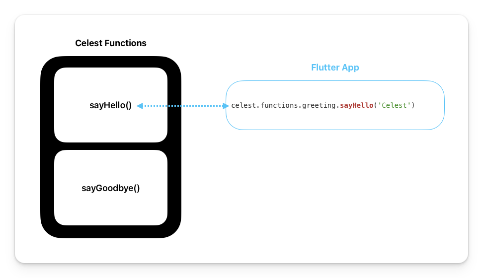

# Create a Function

:::warning
Ensure you have completed [Setting up Celest](/docs/get-started.md) prior to reading this section.
:::

Creating functions with Celest enables you to connect and aggregate information from different parts of your backend, and build custom business logic that runs completely in the cloud. You define your functions as regular Dart functions, and Celest takes care of setting up and managing the backend infrastructure around them.




To get started with building your first function, navigate to the `<flutter_app>/celest/functions/` folder and create a file named `<function_file>.dart`. You can create as many function files as you want in this directory. The name of the file is used to organize and retrieve these functions.

:::tip
Access to your functions is denied by default. What this means is that you’ll need to add the `@functions.public()` annotation to the top of the file for functions to be publicly accessible.

This can be defined for all functions in a file or on a per-function basis. (Same syntax as [middleware](/docs/functions/middleware#applying-middleware-to-single-function))
:::

```dart
// Enables public access to the function.
@functions.public()
library;

import 'package:celest/functions.dart' as functions;

Future<String> sayHello(
  FunctionContext context,
  String name,
) async {
  return 'Hello, $name';
}

Future<String> sayGoodbye(
  FunctionContext context,
  String name,
) async {
  return 'Goodbye, $name';
}
```

The above code snippet is all you need to define your functions! When the `celest start` command runs, a local environment is spun up and a Dart client is generated to help you connect to the local backend.

Below is an example of how you would use the generated client in your `main.dart` file.

```dart
import 'package:flutter/material.dart';
import 'package:flutter_app/celest/client.dart' as celest;

void main() {
  celest.init();
  runApp(const MyApp());
}

class MyApp extends StatelessWidget {
  const MyApp({super.key});

  @override
  Widget build(BuildContext context) {
    return FutureBuilder(
      // Call your function like a normal Dart function!
      future: celest.functions.greeting.sayHello('Celest'),
      builder: (_, snapshot) => switch (snapshot) {
        AsyncSnapshot(:final data?) => Text(data),
        _ => const CircularProgressIndicator(),
      },
    );
  }
}
```