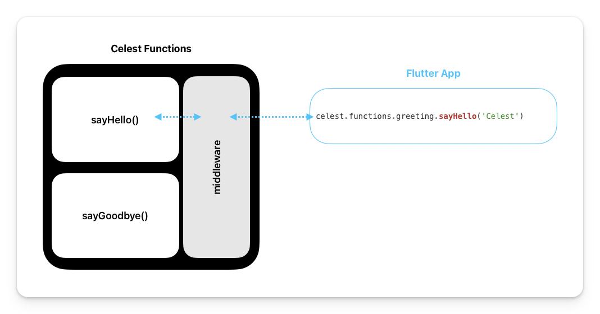

# Attaching middleware

Middleware in Celest enables you to have logic execute before and/or after function calls. You can use it for centralizing and reusing specific functionality for a group of functions in your Celest backend.

## Using middleware with your Celest Functions

To define your middleware, go to your `<flutter_app>/celest/functions/` folder, and create a `<middleware_Name>.dart` file (the name of the file is up to you). The following code snippet shows the examples of two middleware, one for logging requests, and the other for logging responses.

```dart
import 'package:celest/celest.dart';

// A middleware that prints requests to your function.
class logRequests implements Middleware {
  const logRequests();

  @override
  Handler handle(Handler handler) {
    return (request) async {
      print(request);
      return handler(request);
    };
  }
}

// A middleware that prints responses from your function.
class logResponses implements Middleware {
  const logResponses();

  @override
  Handler handle(Handler handler) {
    return (request) async {
      final response = await handler(request);
      print(response);
      return response;
    };
  }
}
```

## Applying middleware to Single Function
To attach a middleware to a function, you can use the `@middleware.<middleware-name>` annotation. The following is an example of using the request and response logging middleware with a function.

<!-- TODO: Decide if I want a picture here  -->

```dart
import 'package:celest/celest.dart';
// highlight-next-line
import 'package:celest/functions/middleware.dart' as middleware;

// Logs requests for only this function.
// highlight-next-line
@middleware.logRequests()
Future<String> sayHello(
  FunctionContext context, 
  String name,
) async {
  return 'Hello, $name';
}

// Logs responses for only this function.
// highlight-next-line
@middleware.logResponses()
Future<String> sayGoodbye(
  FunctionContext context, 
  String name,
) async {
  return 'Goodbye, $name';
}
```

## Applying middleware to all functions
You can alternatively attach middleware to to all functions inside a functions file by applying the middleware annotation at the top of your functions file as shown the following code snippet.

<!-- TODO: Decide if I want to add an image here  -->

```dart
// Logs requests of every function defined in this file.
// highlight-start
@middleware.logRequests()
library;
// highlight-end

import 'package:celest/celest.dart';
// highlight-next-line
import 'package:celest/functions/middleware.dart' as middleware;

Future<String> sayHello(
  FunctionContext context, 
  String name,
) async {
  return 'Hello, $name';
}

Future<String> sayGoodbye(
  FunctionContext context, 
  String name,
) async {
  return 'Goodbye, $name';
}
```

## Stacking middlewares
You also have the option to compose and execute the logic of multiple middleware by stacking them. In the following example, four middleware are composed and will execute in top-down order. When a user calls `sayHello`, the execution order of the middleware will be: `first`, `second`, `third`, then `fourth`.

```dart
// highlight-start
@middleware.first()
@middleware.second()
library;
// highlight-end

import 'package:celest/celest.dart';
// highlight-next-line
import 'middleware.dart' as middleware;

// highlight-start
@middleware.third()
@middleware.fourth()
// highlight-end
Future<String> sayHello(
  FunctionContext context, 
  String name,
) async {
  return 'Hello, $name';
}
```

Since middleware can apply logic before and after a function runs, the composition of the middleware can be thought of as a sandwich. That means, in the previous example, `middleware.first` runs both first _and_ last if it defines both pre- and post-handler logic. The following is a breakdown of the execution sequence for all the middleware and the `sayHello` function.

1. `@middleware.first` pre-handler logic runs
2. `@middleware.second` pre-handler logic runs
3. `@middleware.third` pre-handler logic runs
4. `@middleware.fourth` pre-handler logic runs
5. `sayHello` runs
6. `@middleware.fourth` post-handler logic runs
7. `@middleware.third` post-handler logic runs
8. `@middleware.second` post-handler logic runs
9. `@middleware.first` post-handler logic runs

## Next steps

You now know how to attach and stack middleware to a single or group of functions. You can follow our more of our guides to learn more about [using logging](/docs/functions/logging.md) or [defining custom exceptions](/docs/functions/exceptions.md) for your Celest Functions. 